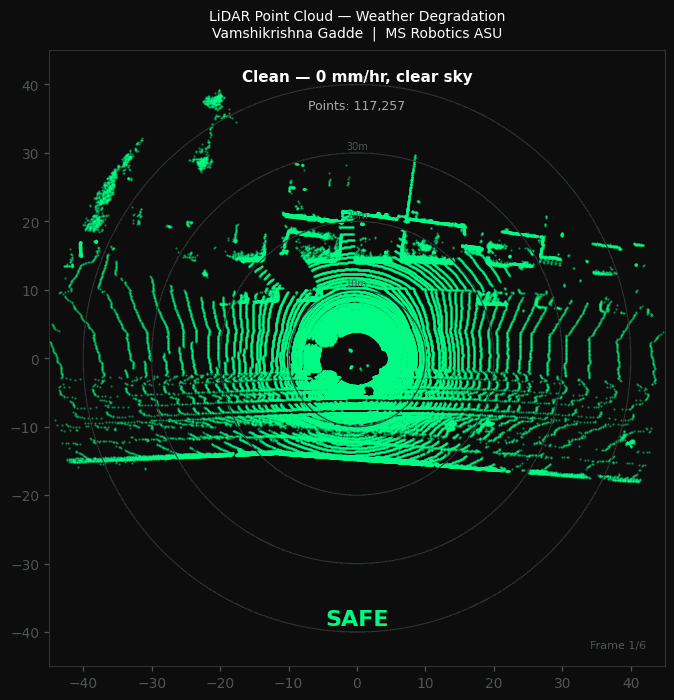
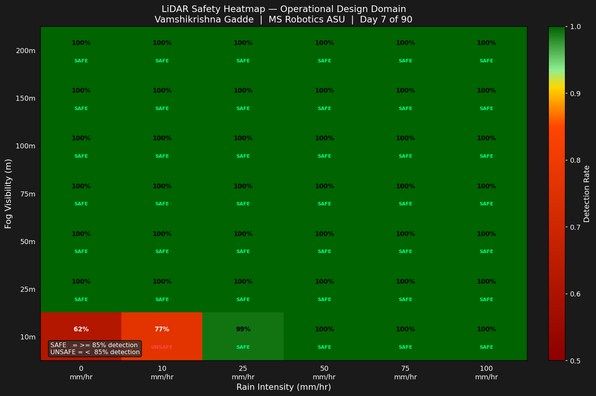
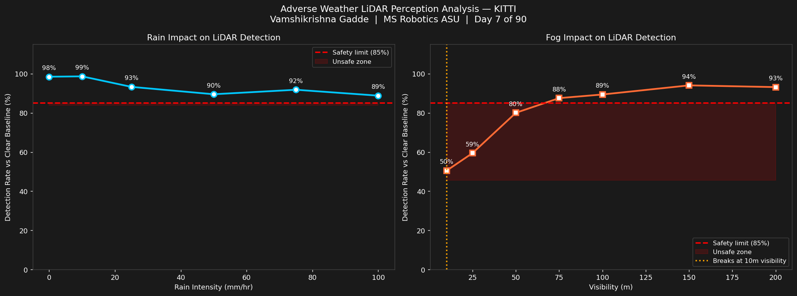
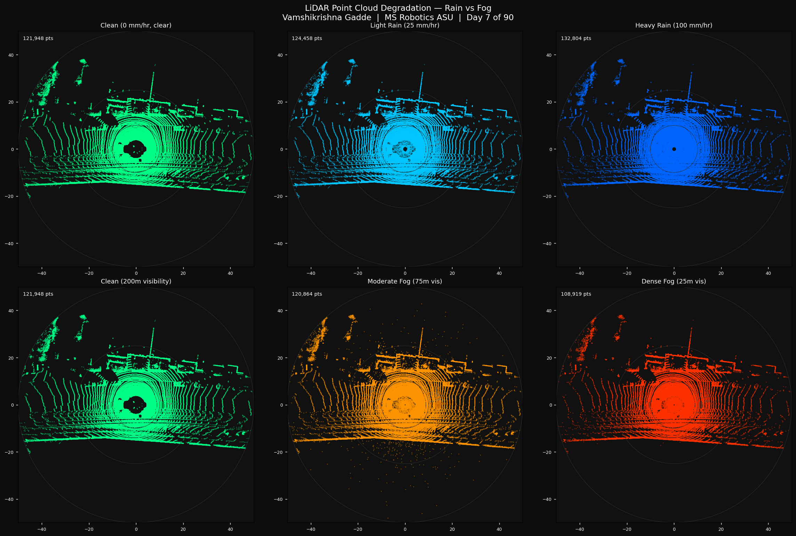
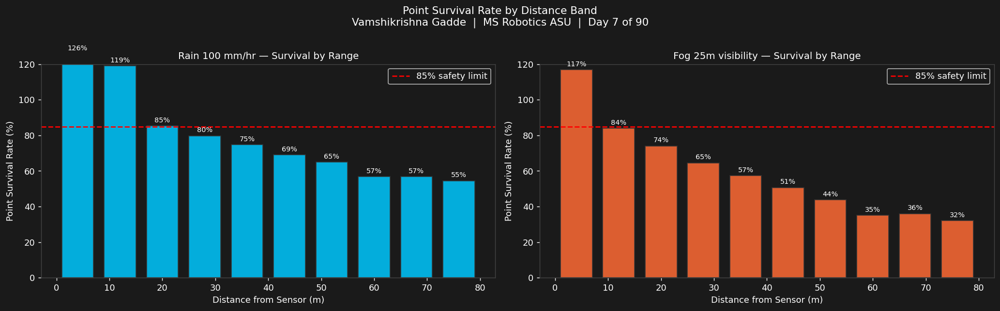

# Day 7: Adverse Weather LiDAR Perception Analysis

**Vamshikrishna Gadde | MS Robotics and Autonomous Systems, ASU, Dec 2026**

---

## The Question Nobody Answers

AV companies test in perfect weather. Then they deploy in rain and fog. At exactly what rainfall or fog density does your LiDAR become unsafe?

I measured mine on real KITTI sensor data across 42 rain and fog combinations.

---

## Point Cloud Degradation



*LiDAR scan degrading from clean through 6 weather conditions.*

---

## Safety Heatmap: Operational Design Domain



*Every rain and fog combination tested. Green = safe. Red = unsafe.*

Almost the entire heatmap is green. Only extreme fog causes unsafe detection. LiDAR is far more weather-resistant than most people assume.

---

## Detection Accuracy vs Weather Intensity



---

## Point Cloud: Clean vs Rain vs Fog



*Top row: rain progression. Bottom row: fog progression.*

---

## Per-Range Survival Analysis



*How weather affects close vs distant objects differently.*

---

## Five Findings

**Rain does not kill LiDAR.**

| Rain (mm/hr) | Detection Rate |
|---|---|
| 0 (clear) | 98.5% |
| 25 (moderate) | 93.3% |
| 50 (heavy) | 89.5% |
| 100 (extreme, Phoenix monsoon) | 88.8% |

Laser pulses at 905nm are not significantly absorbed by millimeter-scale water droplets. LiDAR survives every rain intensity tested.

---

**Fog is the real threat.**

| Visibility | Detection Rate | Status |
|---|---|---|
| 200m (light) | 93.2% | Safe |
| 75m | 87.5% | Safe |
| 50m (dense) | 80.0% | UNSAFE |
| 10m (extreme) | 50.5% | UNSAFE |

Safety boundary: 75m visibility. Below that this system cannot be trusted. Fog droplets are 1-100 micrometers, far smaller than rain droplets, creating millions more laser scattering events per cubic meter.

---

**Rain adds ghost points, not misses.**

```
Clean:           121,948 points
Rain 25 mm/hr:   124,458 points  (+2,510 ghost points)
Rain 100 mm/hr:  132,804 points  (+10,856 ghost points)
```

Rain does not remove real detections. It adds fake ones. At 100 mm/hr there are 24,203 backscatter ghost points in the near field. Phantom braking from false positives at highway speed causes rear collisions. The danger from rain is not missed objects. It is false alarms.

---

**Range determines rain vulnerability.**

```
Rain 100 mm/hr at 0-10m:   126% survival (ghost points dominate)
Rain 100 mm/hr at 30m:      80% survival (below safety threshold)
Rain 100 mm/hr at 60m+:     55% survival (unreliable)
```

Rain kills distant objects first. A pedestrian at 40m in heavy rain has only 69% point survival.

---

**The ODD is almost unlimited.**

```
Rain:  Safe at every intensity tested up to 100 mm/hr
Fog:   Safe above 75m visibility
       Unsafe below 50m visibility
```

---

## Physics Models

```
Rain (Marshall-Palmer Attenuation):
  P_survive = exp(-alpha x intensity x range / MAX_RANGE)
  alpha = 0.01 for 905nm Velodyne HDL-64E

Fog (Koschmieder Visibility Law):
  extinction = 3.912 / visibility_m
  P_survive = exp(-extinction x range / 10.0)
```

---

## Benchmark Scale

```
Frames tested:         10 real KITTI sequences
Rain conditions:       6 levels (0-100 mm/hr)
Fog conditions:        7 levels (10-200m visibility)
Heatmap combinations:  42 rain x fog pairs
```

---

## What I Learned

Fog beats rain because droplet size matters more than droplet count.
Smaller droplets scatter more laser energy per cubic meter.

Ghost points from rain are more dangerous than missed detections.
False positives cause phantom braking. Missed detections cause nothing
until the object gets closer.

The ODD is almost unlimited for LiDAR in rain.
This is not obvious. Most engineers assume rain breaks LiDAR.
It does not. Fog does.

---

## Connection to the Series

```
Day 2: Cameras fail beyond 35m in clear weather
Day 7: LiDAR survives all rain, fails below 75m fog visibility

Camera failure mode:  range-dependent in clear weather
LiDAR failure mode:   extreme fog only

They fail in completely different conditions.
Fusing them covers both failure modes.
Day 8 builds that fusion pipeline.
```

---

## Run It

```bash
git clone https://github.com/GVK-Engine/day-007-adverse-weather-perception
cd day-007-adverse-weather-perception
pip install -r requirements.txt

py -3.11 rain_simulator.py       # rain and fog simulation on one frame
py -3.11 weather_benchmark.py    # full benchmark, 10 frames x 13 conditions
py -3.11 analyze.py              # point cloud and range analysis
py -3.11 visualize_weather.py    # safety heatmap and animated GIF
```

KITTI download: https://www.cvlibs.net/datasets/kitti/raw_data.php

---

## Stack

`Python 3.11` `NumPy` `Matplotlib` `imageio` `KITTI Velodyne HDL-64E`
